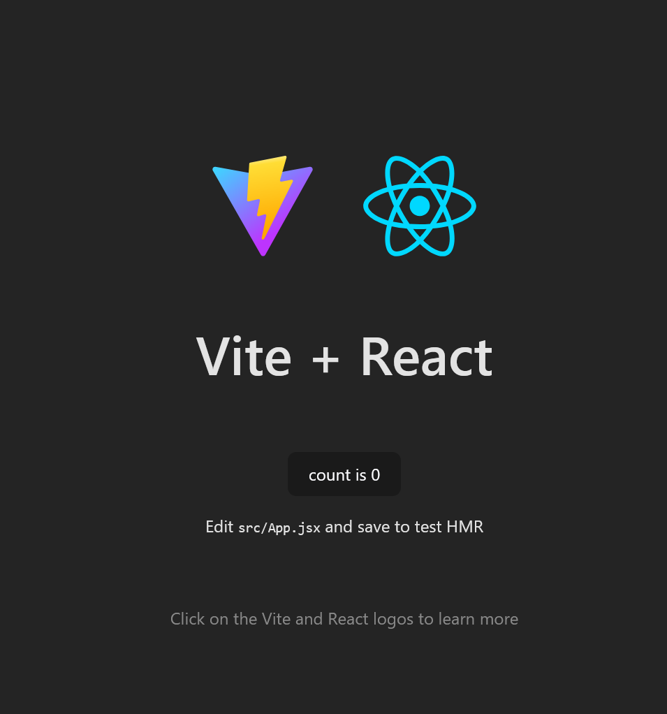

import { FileTree } from '@astrojs/starlight/components';
import { LinkCard } from '@astrojs/starlight/components';

# 前提条件
* WSL or Linux or macOS
WSLのインストール方法は下記記事を参照。

<LinkCard href="../tools/wsl/" title="WSL(Windows Subsystem on Linux)" description="Windows Subsystem for Linuxのインストール方法" />
* pnpm and Node.js
Node.jsとpnpmのインストール方法は下記記事を参照。
<LinkCard href="../tools/pnpm-node/" title="Node.jsとpnpm" description="Node.jsとpnpmのインストール方法について" />

# `pnpm create`を使ってReact + Viteのプロジェクトを作成する
`pnpm create`コマンドを使っていくつかの質問に答えるだけでReact + Viteのプロジェクトを作成できる。

https://ja.vite.dev/guide/#%E6%9C%80%E5%88%9D%E3%81%AE-vite-%E3%83%95%E3%82%9A%E3%83%AD%E3%82%B7%E3%82%99%E3%82%A7%E3%82%AF%E3%83%88%E3%82%92%E7%94%9F%E6%88%90%E3%81%99%E3%82%8B

```sh title="React + Viteのプロジェクトを作成"
$ pnpm create vite
? Project name: vite-project # プロジェクト名 ディレクトリの名前にもなる
? Select a framework:  # 何のUIフレームワークを使うか # 矢印キーで選択してEnterで決定
  Vanilla # フレームワークなし
  Vue # Vue.js を使う
> React # React を使う
  ...
? Select a variant: # どんな構成にするか # 矢印キーで選択してEnterで決定
  TypeScript # TypeScriptを使う
  TypeScript + SWC # TypeScript + SWCを使う
> JavaScript # JavaScriptを使う
  JavaScript + SWC # JavaScript + SWCを使う
  React Router v7 # React Router v7を使う

Scaffolding project in /home/naotiki/playground/vite-project...

Done. Now run:

  cd vite-project
  pnpm install
  pnpm run dev

```
これでReact + Viteのプロジェクトが作成される。
# 起動してみる
* プロジェクトのディレクトリに移動
* `pnpm install`で依存関係をインストール
* `pnpm run dev`で開発サーバーを起動
これで最初の画面をとりあえず表示できる。
```sh
$ cd vite-project #
$ pnpm install
Packages: +255
++++++++++++++++++++++++++++++++++++++++++++++++++++++++++++++++++++++++++++++++++++++++++++++++++++++++++++++++++++++++++++++++++++++++++
Progress: resolved 296, reused 200, downloaded 55, added 255, done

dependencies:
+ react 18.3.1 (19.0.0 is available)
+ react-dom 18.3.1 (19.0.0 is available)

devDependencies:
+ @eslint/js 9.17.0
+ @types/react 18.3.18 (19.0.2 is available)
+ @types/react-dom 18.3.5 (19.0.2 is available)
+ @vitejs/plugin-react 4.3.4
+ eslint 9.17.0
+ eslint-plugin-react 7.37.3
+ eslint-plugin-react-hooks 5.1.0
+ eslint-plugin-react-refresh 0.4.16
+ globals 15.14.0
+ vite 6.0.5

Done in 3.7s
$ pnpm run dev

> vite-project@0.0.0 dev /home/naotiki/playground/vite-project
> vite


  VITE v6.0.5  ready in 164 ms

  ➜  Local:   http://localhost:5173/
  ➜  Network: use --host to expose
  ➜  press h + enter to show help
```
URLが出てくるので、ブラウザで開いてみると...



このようなデフォルトページが表示される。
開発サーバーは`Ctrl + C`で終了できる。

# ファイル構成
<FileTree>

- node_modules/ ライブラリなどが入っているファイル
- public/ そのまま公開されるファイル
  - vite.svg
- src/ ソースコードが入っているファイル
  - assets/ バンドラーによって処理される画像などのリソースファイル
    - react.svg
  - App.css 
  - App.jsx アプリ本体のファイル
  - index.css
  - main.jsx 一番最初に呼び出されるファイル
- .gitignore gitで管理しないファイルを指定するファイル
- eslint.config.js ESLintの設定ファイル
- index.html アプリのHTMLファイル
- package.json npmの設定ファイル
- pnpm-lock.yaml pnpmの依存関係を管理するファイル
- README.md プロジェクトの説明ファイル
- vite.config.js Viteの設定ファイル
</FileTree>

