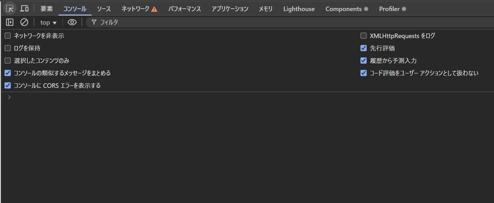
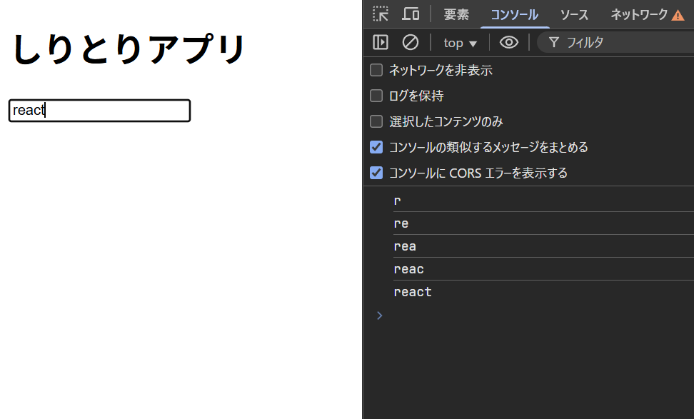
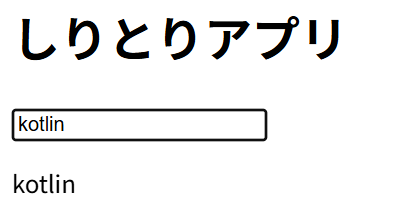

## 文言を変えてみる

`src/App.tsx`を開いてみましょう。
こんなコードが書いてあると思います。

```tsx {"App関数":2-9} title="src/App.tsx"
import './App.css'

function App() {
  return (
    <>
      <h1>Hello, React</h1>
    </>
  )
}

export default App
```

このファイルの`App`関数には、ウェブサイトに表示するものが書いてあります。
試しに、文言を変えてみましょう。
`<h1>Hello, React</h1>`を`<h1>しりとりアプリ</h1>`に変えてみてください。

```tsx title="src/App.tsx" del={6} ins={7}
import './App.css'

function App() {
  return (
    <>
      <h1>Hello, React</h1>
      <h1>しりとりアプリ</h1>
    </>
  )
}

export default App
```

表示が「しりとりアプリ」に変わったと思います。

## 文字の入力欄を作ってみる

`<input>`タグというHTMLタグを使えば、よく見る入力欄を作れます。
追加してみましょう。

```tsx title="src/App.tsx" ins={7}
import './App.css'

function App() {
  return (
    <>
      <h1>しりとりアプリ</h1>
      <input type="text" />
    </>
  )
}

export default App
```

`type="text"`はタグの **属性(attributes)** です。要素に対して表示形式などを指定できます。

```html title="HTMLタグの基本的な文法"
<タグ名 属性名1=属性値1 属性名2=属性値2></タグ名>
```

`<input>`タグは、`type`属性を指定することで、様々な形式の入力欄を作ることができます。

`<input>`の`type`にどんな種類があるかは以下のページから実際に触って確認できます。

<https://developer.mozilla.org/ja/docs/Web/HTML/Reference/Elements/input>

アプリを作るには、何が入力されたか検知する必要があります。
そのためには、`onChange`という「イベント」を使います。

イベントとは、何かが起きたことを表します。
文字が入力されるなど、値が変われば`onChange`イベント
クリックされたら`onClick`イベント
などたくさんあります。

Reactでは、`on<イベント名>={<関数>}`とすると、イベントがトリガー(発生、発火)したときに、実行する関数を指定できます。(その実行される関数を「イベントハンドラ」、「コールバック」などと呼ぶ)
以下のように書き換えてみましょう。

```tsx title="src/App.tsx" del={7} ins={8-13}
import './App.css'

function App() {
  return (
    <>
      <h1>しりとりアプリ</h1>
      <input type="text" />
      <input
        type="text"
        onChange={(event) => {
          console.log(event.target.value);
        }}
      />
    </>
  )
}

export default App
```

JavaScript/TypeScriptでは`(<引数>)=><処理>`という形で、関数を書くことができます。(ラムダ式という)
それを`input`タグの`onChange`属性に指定することで、入力が変更されたときにその関数を実行させることができます。

今回は変更後の値(`event.target.value`)を`console.log()`関数でブラウザのコンソールと呼ばれる場所に表示させています。

ブラウザのコンソールは、F12キー(または Ctrl+Shift+I)を押すと開くことができる「DevTool」(開発者ツール)の中にあります。
F12キーを押して、Consoleタブを選択してみてください。



何か文字を入力してみると、コンソールに入力した文字が表示されると思います。



「react」は5文字なので5回`onChange`イベントがトリガーします。

## 文字を表示させてみる

次は、入力した文字を画面に表示させてみましょう。

```tsx title="src/App.tsx"  ins={1,5-6,14,17} del={13}
import { useState } from "react";
import "./App.css";

function App() {
  const [text, setText] = useState("");

  return (
    <>
      <h1>しりとりアプリ</h1>
      <input
        type="text"
        onChange={(event) => {
          console.log(event.target.value);
          setText(event.target.value);
        }}
      />
      <p>{text}</p>
    </>
  );
}

export default App;
```

Reactには「状態(State)」という重要な概念があります。
Reactでは。`useState`という関数を使って「記憶」をさせることができます。
（なぜ普通の変数ではだめなのかは、後で説明します）

`useState`を使うにはまず、`import`文を使って、`useState`を使う旨を宣言します。

```tsx
import { useState } from "react";
```

importできたら、`useState`を使って状態を作ります。

```tsx
const [text, setText] = useState("");
```

`useState("")`の`""`は初期値を表します。

やっていることは変数の初期化と一緒です。

```c title="C言語の変数初期化"
char text[100] = "";
```

`useState`で作った状態を`const`を使って変数に代入しています。
`const [text, setText]`のように、`[]`で囲むことで、2つの変数を同時に作ることができます。
1番目の`text`は状態の値を表し、2番目の`setText`は状態を変更するための関数です。

### 状態の値を使う(読み取る)場合

普通の変数のように先程の例では、1番目にある`text`と書けば使えます。

```tsx
text
```

ちなみにWebサイトの中に表示させるには、`<p>{text}</p>`のように`{}`で囲むことで、値を表示できます。

```tsx
<p>{text}</p>
```

`{}`で囲んで表示できるのは、もちろん状態だけではなく普通の変数など様々なものです。
なので、計算もできます。

```tsx
<p>{19*3}</p>
```

### 状態の値を変更する(書き換える)場合

状態の値を変更するには、2番目の`setText`関数を使います。

```tsx
setText("新しい値");
```

この関数を実行すると、`text`の値が「`"新しい値"`」に書き換わります。

:::caution
普通の変数のように状態に`=`で再代入することはできません。

```tsx title="NGな例"
text = "新しい値";
```

:::

うまくコードがかけていれば、入力した文字が即座に入力欄の下に表示されると思います。



<details>
<summary>
(おまけ)なぜ useState を使う必要があるのか
</summary>

`useState`を使わずに、ほぼ同じコードを書いてみました。

```tsx {5,12}
import { useState } from "react";
import "./App.css";

function App() {
  let text = "";
  return (
    <>
      <h1>しりとりアプリ</h1>
      <input
        type="text"
        onChange={(event) => {
          text = event.target.value;
        }}
      />
      <p>{text}</p>
    </>
  );
}

export default App;
```

`let`は変数を再代入可能なものとして宣言するものです。

このコードを試してみると入力された文字が表示されません。

なぜでしょうか？理由はいくつかあります。

#### 1. 再レンダリングされない

Reactは普通の変数の値の変化を検知できません。
つまり、変数の値が変わろうがReactは知ったこっちゃないわけです。
そのため、`text`の値が変わっても、Reactはそれを検知できず、画面を更新(再レンダリング)しません。
なので、`setText`のように、更新する専用の関数を呼び出してあげることで、Reactに「この値が変わったから、再レンダリングお願いします」と伝える必要があります。

#### 2. 初期化される

Reactでは`App`関数のようにHTMLを返す関数を「コンポーネント」と呼びます。
実は、コンポーネント関数はレンダリングされるたびに関数自体が再実行されます。
そのため、その関数内に`let text = "";`と書くと、毎回`text`が`""`で初期化されてしまいます。
なので、`useState`を使って、Reactに「これは状態だから別の場所に記憶しておいてね」と伝える必要があります。

</details>

## ボタンのクリックを検知する

次はボタンを追加して、クリックを検知してみましょう。

```tsx title="src/App.tsx" ins={16-23}
import { useState } from "react";
import "./App.css";

function App() {
  const [text, setText] = useState("");

  return (
    <>
      <h1>しりとりアプリ</h1>
      <input
        type="text"
        onChange={(event) => {
          setText(event.target.value);
        }}
      />
      <button
        type="button"
        onClick={() => {
          setText("Clicked!");
        }}
      >
        ボタン
      </button>
      <p>{text}</p>
    </>
  );
}

export default App;

```

クリックすると「Clicked!」と表示されればOKです。
先ほど説明した、イベントを使ってボタンのクリックを検知しています。
`onClick`イベントハンドラは要素のクリックを検知します。
