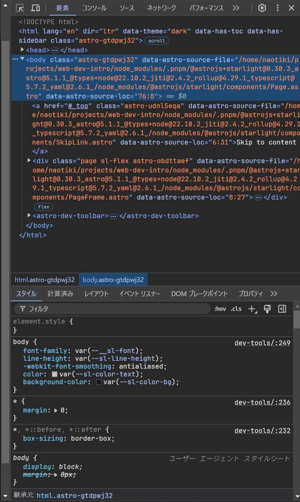
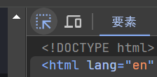
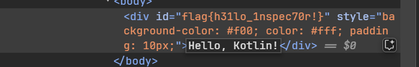
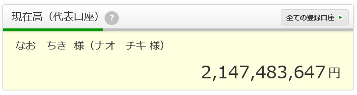

import { Tabs, TabItem } from '@astrojs/starlight/components';

# 対象ブラウザ
* Chrome (Chromium basedなら何でも,Braveとか、Edgeとか)

# DevTools (開発ツール)とは？
DevToolsとは、ブラウザの開発者向けツールのこと。これをうまく使うことで、開発速度を向上させたり、Webサイトのデバッグがしやすくしたりできる。

# 使い方
`F12`キーまたは`Ctrl + Shift + I`で開く。(Webページを右クリックして「検証」や「調査」でも開ける)
押してみよう！

こんな感じの画面が出てくるはず。

ここからはタブごとに便利な機能を紹介する。

# インスペクター(要素) タブ
現在見ているページのHTML要素を確認できる。また、HTML、CSSの編集もできる。
## 特定要素へのフォーカス
要素(ページ内のどこか)を右クリックして「要素を検証/調査」を選択すると、その要素がインスペクターに表示される。
または、インスペクターの左上にあるカーソルアイコンをクリックして、要素を選択することもできる。

試しに下のHello, World!の要素を「検証/調査」してみよう
↓
<iframe srcdoc={`
<html>
  <body>
    
Hello, World!

  </body>
</html>
`}/>

`id="flag{h31lo_1nspec70r!}"`が見れればOK。

また、文字を変更することもできる。
インスペクターの変更したい文字の部分をダブルクリックすると編集できる。

つまり、こんな画像を作るのも簡単だということ。

これまでの説明の通り、DevToolsはブラウザ上のHTMLはもちろんのことCSSやJSも変更できる。
これをうまく使うと開発速度を上げることができる。

## CSSをすぐに変える
インスペクターを使うと、CSSをすぐに変更し、その結果を見れる。
例えば`display:flex`はとても便利だが、自分のやりたいレイアウトを実現するにはどのようなスタイルを指定すればいいのか、わからないことがある。(少なくとも私は)

そんな時、DevToolsには便利な機能がある。
`display:flex`を使った上のデザインを下のように変更したいとする。

<iframe srcdoc={`
<html>
  <body>
    

      
1

      
2

      
3

    

  </body>
</html>
`}/>
↓
<iframe srcdoc={`
<html>
  <body>
    

      
1

      
2

      
3

    

  </body>
</html>
`}/>

# 関連

https://developer.mozilla.org/ja/docs/Glossary/Developer_Tools

