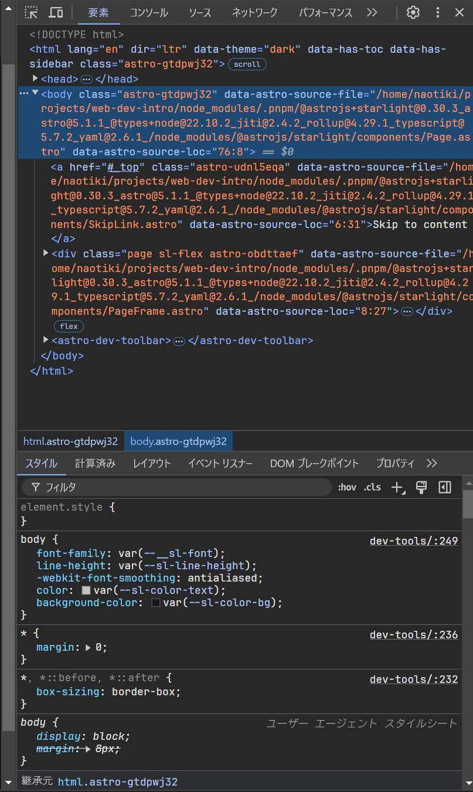
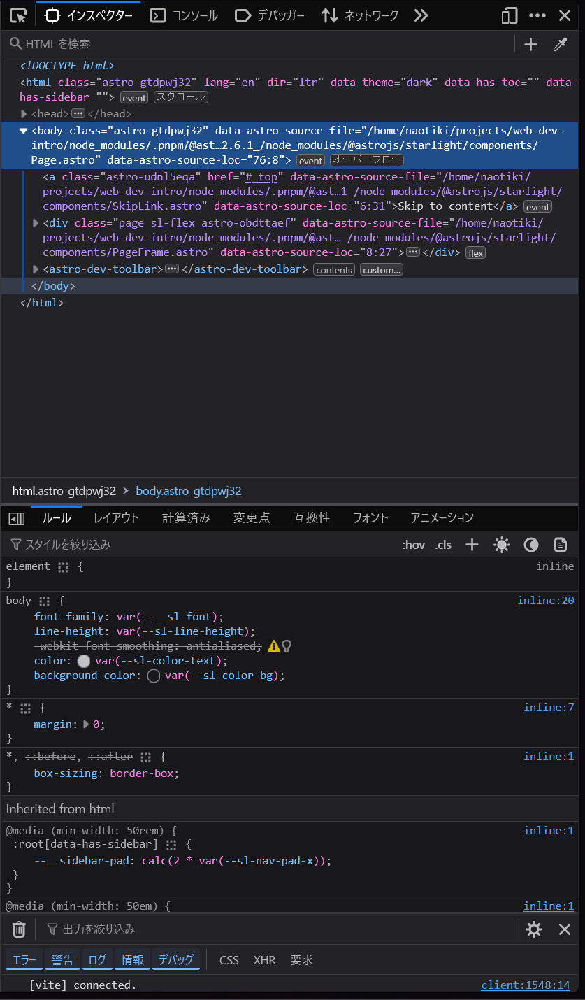
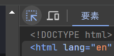
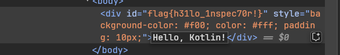

import { Tabs, TabItem } from '@astrojs/starlight/components';

# 対象ブラウザ
* Chrome (Chromium basedなら何でも)
* Firefox

# DevTools (開発ツール)とは？
DevToolsとは、ブラウザの開発者向けツールのこと。これをうまく使うことで、開発速度を向上させたり、Webサイトのデバッグがしやすくしたりできる。

# 使い方
`F12`キーまたは`Ctrl + Shift + I`で開く。(Webページを右クリックして「検証」や「調査」でも開ける)
押してみよう！

<Tabs>
  <TabItem label="Chrome">
    
  </TabItem>
  <TabItem label="Firefox">
    
  </TabItem>
</Tabs>
こんな感じの画面が出てくるはず。

ここからはタブごとに便利な機能を紹介する、

# 要素 / インスペクター タブ
現在見ているページのHTML要素を確認できる。また、HTML、CSSの編集もできる。
## 特定要素へのフォーカス
要素を右クリックして「要素を検証」を選択すると、その要素がインスペクターに表示される。
または、インスペクターの左上にあるカーソルアイコンをクリックして、要素を選択することもできる。

試しに下のHello, World!の要素を「検証」してみよう
↓
<iframe srcdoc={`
<html>
  <body>
    
Hello, World!

  </body>
</html>
`}/>

`id="flag{h31lo_1nspec70r!}"`が見れればOK。

また、文字を変更することもできる。
インスペクターの変更したい文字の部分をダブルクリックすると編集できる。

# 関連

https://developer.mozilla.org/ja/docs/Glossary/Developer_Tools

