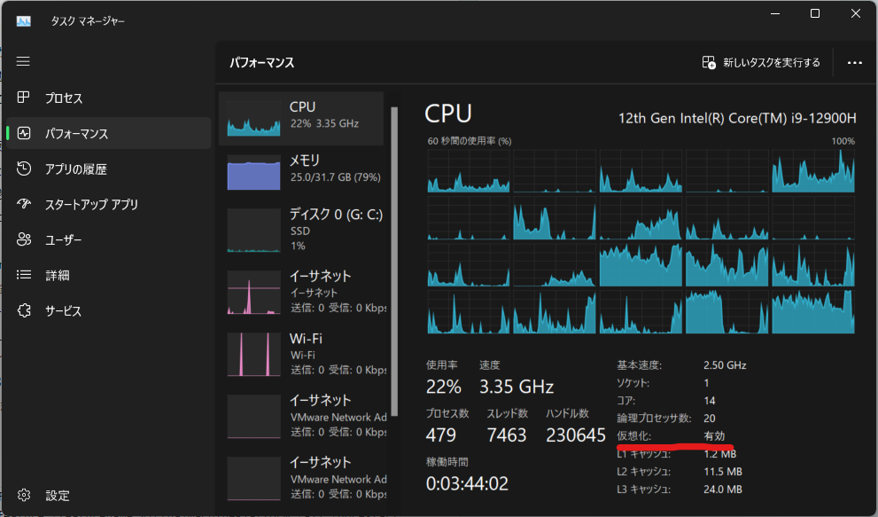

import wsl_install_command from './assets/wsl/wsl_install_command.mp4';
import wsl_install_manual from './assets/wsl/wsl_install_manual.mp4';

# WSLとは
WSL (Windows Subsystem on Linux) とはWindows上でLinuxを動かすための機能です。
プロジェクトによってはLinux/macOS前提なものもあるので、基本的にWSLを入れておくのがおすすめです。

# WSLのインストール


## 前提条件 仮想化支援機能が有効か確認

タスクマネージャーの仮想化が**有効**ならOK



無効であれば下記記事を参考にしつつ仮想化を有効にする。

PC（マザーボード/CPU）のメーカーによって手順が違うので「自分のPCメーカー名 仮想化」とかで検索するといいかも。

https://support.microsoft.com/ja-jp/windows/windows-11-pc-で仮想化を有効にする-c5578302-6e43-4b4b-a449-8ced115f58e1

<details>
<summary>仮想化支援有効のざっくりとした流れ</summary>
    UEFI (BIOS)に入って
    - Virtualization
    - Intel VT-d
    などの項目があれば **有効(Enabled)** にする
    :::caution
    CPUやマザーボードのメーカーによって設定内容が変わるので注意！
    :::
</details>
## 方法1 `wsl --install`

https://learn.microsoft.com/ja-jp/windows/wsl/install


:::note
最初から `wsl`コマンドが使えるのは、Windows 11もしくは一部のWindows 10のみです。
`wsl` コマンドが使えない場合は、[方法2 手動で設定](#方法2-手動で設定) を試してください。
:::

「スタート」(🪟)を右クリックして「ターミナル」もしくは「PowerShell」を開く

1. `wsl --install` を実行
2. 終わるまで待つ
3. 再起動
4. Ubuntuが自動で起動するのでインストールが終わるまで待つ
(自動で起動しなければ、スタートメニューから「Ubuntu」を手動で起動する)
5. [初期設定](#初期設定) をする

<video src={wsl_install_command} controls="true"></video>

## 方法2 手動で設定

https://learn.microsoft.com/ja-jp/windows/wsl/install-manual

<video src={wsl_install_manual} controls="true"></video>

## 初期設定

1. `Enter new UNIX username:` と聞かれるのでユーザー名を入力
:::caution
注意：ユーザー名は英小文字から始め、残りは英小文字/数字のみ使う
- ⭕️naotiki, j22413, kotlin1234
- ❌️なおちき, 22413, Kotlin1234
:::

2. `New password:` でパスワードを入力 
入力した文字は表示されないので注意 もちろん今後もずっと使うので覚えておこう
3. `Retype new password:` で先程入力したパスワードを再度入力
4. 完了！

## アップデート & アップグレード

`apt` コマンドを使用してすでに入っているパッケージ(ソフトウェア)のアップデートを行う

### アップデート

**パッケージ一覧**を更新する。入ってるパッケージを更新するわけではない。
これをすることで最新バージョンがあり、アップデート可能なパッケージがわかる。
実行するには以下のコマンドを入力

```bash
sudo apt update
```

更新の前だけでなく、なにかパッケージをインストールする前にも行えるようにクセを付けておこう。

### アップグレード

パッケージ一覧を元にアップデート可能なパッケージを最新にする。

実行するには

```bash
sudo apt upgrade
```